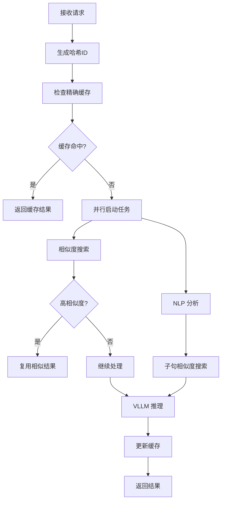

# Enhanced AsyncLLM 技术详解

## 概述

`EnhancedAsyncLLM` 是基于 VLLM 的 `AsyncLLM` 构建的增强版异步大语言模型引擎，集成了智能缓存、NLP 分析和相似度搜索功能。该实现在保持原有 VLLM 高性能特性的基础上，通过多层次优化策略显著提升了推理效率和用户体验。

## 核心架构

### 继承设计

```python
class EnhancedAsyncLLM(AsyncLLM):
    """增强的 AsyncLLM，集成缓存、NLP 和相似度搜索功能"""
```

`EnhancedAsyncLLM` 继承自 VLLM 的 `AsyncLLM`，确保了：
- **完全兼容性**：支持所有原生 VLLM 功能
- **无缝集成**：可直接替换现有 AsyncLLM 实例
- **性能保证**：保持 VLLM 的高性能特性

### 核心组件

#### 1. 多级缓存管理器 (MultiLevelCacheManager)
- **内存缓存**：快速访问热点数据
- **Redis 缓存**：持久化存储和分布式共享
- **智能淘汰**：LRU 策略优化内存使用

#### 2. 相似度搜索助手 (SimilaritySearchHelper)
- **向量搜索**：基于 FAISS 的高效语义搜索
- **批量处理**：优化多查询性能
- **阈值控制**：精确控制相似度匹配

#### 3. 异步 NLP 处理器 (AsyncConjunctionExtractor)
- **连接词提取**：识别复合查询结构
- **子句分解**：将复杂查询拆分为子问题
- **并发控制**：限制并发任务数量防止资源耗尽

#### 4. 共享内存管理器 (SimilarRequestMemoryManager)
- **请求映射**：存储相似请求关联关系
- **Token 映射**：缓存生成的 Token 序列
- **内存优化**：高效的共享内存使用

## 工作原理

### 请求处理流程



### 1. 请求预处理

#### 哈希生成
```python
def _generate_hash_id(self, prompt: str, sampling_params: SamplingParams) -> str:
    """生成请求的哈希ID"""
    return self.hasher.compute_hash_id(prompt, sampling_params)
```

- 基于 prompt 和 sampling_params 生成唯一哈希
- 确保相同请求能够精确匹配缓存
- 支持参数敏感的缓存策略

#### 缓存检查
```python
async def _check_cache(self, request_id: str, cache_entry: CacheEntry, prompt: str) -> Optional[CustomRequestOutput]:
    """检查缓存，返回缓存结果或None，兼容旧缓存格式"""
```

- **精确匹配**：优先检查完全相同的请求
- **格式兼容**：支持多种缓存数据格式
- **自动更新**：更新访问时间和统计信息

### 2. 并行优化策略

#### 任务管理
```python
def _create_task(self, coro, task_name: str) -> asyncio.Task:
    """创建并管理异步任务，确保与输出处理器协调"""
```

- **任务追踪**：维护活跃任务字典
- **资源清理**：自动清理完成的任务
- **错误处理**：捕获和记录任务异常

#### 并行执行
```python
# 并行启动相似度搜索和NLP分析
initial_similarity_task = self._create_task(
    self.similarity_search_helper.search_similar_questions_with_reuse_check(
        prompt, top_k=10, similarity_threshold=0.85
    ), f"{task_prefix}_initial_similarity"
)

nlp_task = self._create_task(
    self.conjunction_extractor.extract_conjunctions_async(prompt),
    f"{task_prefix}_nlp"
)
```

### 3. 智能相似度搜索

#### 多层次搜索策略

1. **原始问题搜索**
   - 直接搜索完整 prompt
   - 高阈值匹配（0.95+）可直接复用
   - 中等阈值匹配作为候选

2. **子句分解搜索**
   - NLP 分析提取子句
   - 批量搜索子句相似度
   - 综合评估匹配结果

#### 相似度阈值控制
```python
async def _perform_subsentence_similarity_search(
    self, nlp_result: Dict[str, Any], 
    top_k: int = 10, 
    similarity_threshold: float = 0.7
) -> List[Dict[str, Any]]:
```

- **动态阈值**：根据查询复杂度调整
- **批量优化**：一次性处理多个子句
- **结果去重**：避免重复匹配

### 4. NLP 增强处理

#### 异步连接词提取
```python
if self.handler_config.features.enable_nlp_enhancement:
    self.conjunction_extractor = AsyncConjunctionExtractor()
    self.conjunction_extractor.set_max_concurrent_tasks(self._nlp_max_concurrent)
```

- **并发控制**：限制同时处理的 NLP 任务数量
- **资源管理**：防止 NLP 处理占用过多资源
- **异步处理**：不阻塞主要推理流程

#### 子句分解
- 识别复合查询中的连接词
- 将复杂问题分解为独立子问题
- 支持并行处理子问题

### 5. 共享内存优化

#### 相似度上下文存储
```python
async def _store_similarity_context(self, request_id: str, similar_answers: List[Dict[str, Any]]) -> None:
    """存储相似度上下文到共享内存"""
```

- **请求映射**：存储请求间的相似关系
- **Token 缓存**：预存储相似答案的 Token 序列
- **批量操作**：优化内存访问性能

#### 内存管理配置
```python
config = SimilarRequestMemoryConfig(
    request_mapping_memory_size=8 * 1024 * 1024,  # 8MB
    token_mapping_memory_size=8 * 1024 * 1024,    # 8MB
    max_entries=5000,
    request_mapping_shared_name="vllm_request_mappings",
    token_mapping_shared_name="vllm_token_mappings"
)
```

### 6. 缓存更新策略

#### 异步缓存更新
```python
async def _do_cache_update(
    self, prompt: str, sampling_params: SamplingParams, 
    request_id: str, hash_id: str, output: CustomRequestOutput
) -> None:
```

- **非阻塞更新**：不影响结果返回
- **格式标准化**：统一缓存数据格式
- **向量索引更新**：同步更新搜索索引

#### 多格式兼容
- 支持文本格式缓存
- 支持 Token ID 列表
- 支持 RequestOutput 对象
- 自动格式转换和标准化

## 性能优化特性

### 1. 异步并行处理
- **任务并行**：相似度搜索和 NLP 分析并行执行
- **非阻塞缓存**：缓存更新不阻塞结果返回
- **资源隔离**：不同任务使用独立资源池

### 2. 智能缓存策略
- **多级缓存**：内存 + Redis 双层缓存
- **相似度匹配**：基于语义相似度的智能复用
- **自动淘汰**：LRU 策略优化内存使用

### 3. 内存优化
- **共享内存**：减少数据复制开销
- **批量操作**：优化 I/O 性能
- **懒加载**：按需加载组件

### 4. 错误恢复
- **任务隔离**：单个任务失败不影响整体
- **自动重试**：关键操作支持重试机制
- **降级策略**：组件失败时自动降级

## 配置选项

### HandlerConfig 配置
```python
class HandlerConfig:
    features: FeatureConfig
    performance: PerformanceConfig
    cache: CacheConfig
```

### 关键配置项
- `enable_nlp_enhancement`: 启用 NLP 增强功能
- `enable_detailed_logging`: 启用详细日志
- `nlp_max_concurrent`: NLP 最大并发数
- `similarity_threshold`: 相似度阈值

## 使用示例

### 基本使用
```python
# 创建增强版 AsyncLLM
enhanced_llm = EnhancedAsyncLLM.from_vllm_config(
    vllm_config=vllm_config,
    cache_manager=cache_manager,
    similarity_search_helper=similarity_helper,
    handler_config=handler_config
)

# 异步生成
async for output in enhanced_llm.generate(
    prompt="你好，请介绍一下人工智能",
    sampling_params=SamplingParams(temperature=0.7)
):
    print(output.outputs[0].text)
```

### 高级配置
```python
# 自定义配置
handler_config = HandlerConfig(
    features=FeatureConfig(
        enable_nlp_enhancement=True,
        enable_detailed_logging=True
    ),
    performance=PerformanceConfig(
        nlp_max_concurrent=50
    )
)
```

## 技术优势

1. **高性能**：保持 VLLM 原生性能，额外优化减少延迟
2. **智能化**：基于 NLP 和相似度的智能缓存策略
3. **可扩展**：模块化设计，易于扩展新功能
4. **兼容性**：完全兼容 VLLM 生态系统
5. **可靠性**：完善的错误处理和恢复机制

## 监控和调试

### 日志系统
- 使用 loguru 提供结构化日志
- 支持不同级别的日志输出
- 详细的性能指标记录

### 性能指标
- 缓存命中率统计
- 相似度搜索性能
- NLP 处理时间
- 内存使用情况

## 最佳实践

1. **合理配置并发数**：根据硬件资源调整 NLP 并发数
2. **优化相似度阈值**：根据业务需求调整匹配阈值
3. **监控缓存性能**：定期检查缓存命中率和内存使用
4. **错误处理**：实现适当的错误处理和降级策略

## 总结

`EnhancedAsyncLLM` 通过集成智能缓存、NLP 分析和相似度搜索，在保持 VLLM 高性能的基础上，显著提升了推理效率和用户体验。其模块化设计和完善的错误处理机制，使其成为生产环境中可靠的大语言模型推理解决方案。